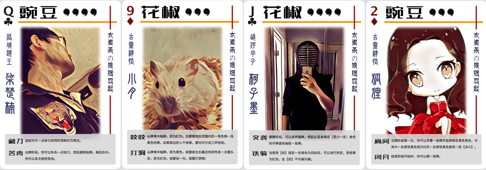

>Note: This project creates custom character cards(like Bang!) based on users' input. It's optimized for Chinese characters, and won't work for western languages out of box. (Might work for Japanese and Korean.) Therefore only Chinese instruction is provided here. 
>
>Please let me know if you want other language support.

# 英雄卡牌生成器

利用`HTML`+`CSS`+`NodeJS`+`PhantomJS`生成三国杀风格的人物卡牌。



>上图中的头像经prisma处理，该项目不包含图片滤镜功能。如果有免费开源滤镜推荐，可以自己集成哦~

## 使用说明
```bash
npm install
node automation.js
```

把图片和描述人物的JSON文件放到`./data/`中，图片名字必须与JSON文件中的`id`相同。可接受图片格式为
- png/PNG
- jpg/jpeg/JPG/JPEG

### 例子
`./data/`中有`zhangsanfeng.json`和`zhangsanfeng.jpg`。 其中JSON文件内容如下:

```
{
  "id": "zhangsanfeng",
  "clan": "武当",
  "blood_number": "4",
  "nickname": "一代宗师",
  "name": "张三丰",
  "skills_group": [
    {
      "title": "突袭",
      "description": "摸牌阶段，可以放弃摸牌，然后从至多两名（至少一名）角色的手牌里各抽取一张牌。"
    },
    {
      "title": "铁骑",
      "description": "当使用【杀】指定一名角色为目标后，可以进行判定，若结果为红色，此【杀】不可被闪避。"
    }
  ]
}
```

> Note: `skills_group`可以省略，详情参考[issue #1](https://github.com/hackjutsu/HeroCards/issues/1)

## FAQ
Q: 会制作一个GUI方便大家使用吗？
A: 欢迎PR。

Q: 中文字体能够商用么？ A: 可以。

Q: 可以修改主题吗？ A: 可以在templates文件夹中建立自己的html template。

## 打印效果


## License
[MIT @CosmoX](./LICENSE)
